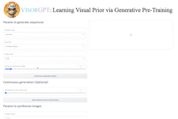

[//]: # (<div align=center>)

[//]: # ()

[//]: # (</div>)

<div align="center">
<h1>VisorGPT 🎨 (NeurIPS 2023)</h1>
<h3>Learning Visual Prior via Generative Pre-Training</h3>


[Jinheng Xie](https://sierkinhane.github.io/)<sup>1</sup>&nbsp; Kai Ye<sup>2</sup>&nbsp; Yudong Li<sup>2</sup>&nbsp; Yuexiang Li<sup>3</sup>&nbsp; Yefeng Zheng<sup>3</sup> Linlin Shen<sup>2</sup>&nbsp; [Mike Zheng Shou](https://scholar.google.com/citations?hl=zh-CN&user=h1-3lSoAAAAJ&view_op=list_works&sortby=pubdate)<sup>1</sup> 

<sup>1</sup> National University of Singapore&nbsp; <sup>2</sup> Shenzhen University&nbsp; <sup>3</sup> Jarvis Research Center, Tencent YouTu Lab

[](http://arxiv.org/abs/2305.13777) [](https://huggingface.co/spaces/szukevin/VISOR-GPT) [](https://www.youtube.com/watch?v=8FDoBfxSY8I) [](https://sierkinhane.github.io/visor-gpt/)

</div>



## Updates

- [2023/05/23] Paper is available.
- [2023/05/28] Gradio demo is available.
- [2023/05/30] [Hugging Face demo is available](https://huggingface.co/spaces/szukevin/VISOR-GPT).
- [2023/06/13] Training code and data are available.
- [2023/09/22] VisorGPT is accepted by **NeurIPS 2023**.

## Quick Start

### Step 1

```
# clone the repo
git clone https://github.com/Sierkinhane/VisorGPT.git

# go to directory
cd VisorGPT

# create a new environment
conda create -n visorgpt python=3.8

# activate the new environment
conda activate visorgpt

# prepare the basic environments
pip3 install -r requirements.txt

# install controlnet and gligen
cd demo/ControlNet
pip3 install -v -e .
cd ../demo/GLIGEN
pip3 install -v -e .
```

### Step 2 - Download pre-trained weights

Download [visorgpt](https://drive.google.com/file/d/1Pk4UPNKBMH-0uRLmK5COYTca7FUrN8XY/view?usp=sharing), [controlnet-pose2img](https://huggingface.co/lllyasviel/ControlNet-v1-1/blob/main/control_v11p_sd15_openpose.pth), [controlnet-sd](https://huggingface.co/runwayml/stable-diffusion-v1-5/blob/main/v1-5-pruned-emaonly.safetensors), [gligen-bbox2img](https://huggingface.co/gligen/gligen-generation-text-box/blob/main/diffusion_pytorch_model.bin), and put them as follow:

```
├── demo/
|   ├── ckpts
|   |   ├── controlnet
|   |   |   ├── control_v11p_sd15_openpose.pth
|   |   |   ├── v1-5-pruned-emaonly.safetensors
|   |   ├── gligen
|   |   |   ├── diffusion_pytorch_model_box.bin
|   |   ├── visorgpt
|   |   |   ├── visorgpt_dagger_ta_tb.pt
```

### Step 3 - Run demo

```
CUDA_VISIBLE_DEVICES=0 python3 gradio_demo.py
```

## Training
1. Download the preprocessed json files at [here](https://drive.google.com/drive/folders/1PL3RMPLUT3bFB-RHtMBzVkOLbQu_rDJF?usp=sharing).
2. Process them into text corpora,
e.g.,
```
# box type
python3 preprocess_coord.py --input_path path/to/coco_train.json --data_type box --output_dir txt_train
# keypoint type
python3 preprocess_coord.py --input_path path/to/cocokeypoints_train.json --data_type keypoint --output_dir txt_train
# mask type
python3 preprocess_coord.py --input_path path/to/coco_train.json --data_type mask --output_dir txt_train
```
3. If you have processed several .txt files, you can merge them into one `.txt` file, e.g.,
```
python3 utiles/merge_files.py --file_dir txt_train --output_file_path train.txt
```
4. Tokenize the text corpora.
```
cd train/
python3 preprocess.py --corpus_path ../train.txt \
                      --vocab_path models/google_uncased_en_coord_vocab.txt \
                      --dataset_path train.pt --processes_num 8 \
                      --seq_length 1024 --tgt_seq_length 1024 --data_processor lm
```
5. Train GPT-2 (based) model. The training process requires 8 V100(32GB).
```
deepspeed pretrain.py --deepspeed --deepspeed_config models/deepspeed_config.json \
                    --dataset_path train.pt \
                    --vocab_path models/google_uncased_en_coord_vocab.txt \
                    --config_path models/gpt2/config.json \
                    --output_model_path train.bin \
                    --world_size 8 --gpu_ranks 0 1 2 3 4 5 6 7 \
                    --total_steps 200000 --save_checkpoint_steps 5000 --report_steps 100 \
                    --learning_rate 5e-5 --batch_size 16
```
Or you can directly download the tokenized data from [here](https://drive.google.com/file/d/1VVw7zypNtkiMwJa3exGVZ31XnZCjYU6f/view?usp=sharing) (around 340K sequences)  and put it into the directory of `train/`. 
```
deepspeed pretrain.py --deepspeed --deepspeed_config models/deepspeed_config.json \
                    --dataset_path visorgpt_dagger_train_seq.pt \
                    --vocab_path models/google_uncased_en_coord_vocab.txt \
                    --config_path models/gpt2/config.json \
                    --output_model_path models/visorgpt_dagger_train_seq.bin \
                    --world_size 8 --gpu_ranks 0 1 2 3 4 5 6 7 \
                    --total_steps 200000 --save_checkpoint_steps 10000 --report_steps 100 \
                    --learning_rate 5e-5 --batch_size 16
```

## Inference
```
CUDA_VISIBLE_DEVICES=0 python3 scripts/generate_lm_multiple.py --load_model_path models/visorgpt_dagger_train_seq.bin/200000/mp_rank_00_model_states.pt \
                               --vocab_path models/google_uncased_en_coord_vocab.txt \
                               --test_path beginning.txt --prediction_path generated_sentence.txt \
                               --config_path models/gpt2/config.json --seq_length 512
                               
or 
CUDA_VISIBLE_DEVICES=0 python3 scripts/generate_lm_multiple.py --load_model_path models/visorgpt_dagger_train_seq.bin \
                               --vocab_path models/google_uncased_en_coord_vocab.txt \
                               --test_path beginning.txt --prediction_path generated_sentence.txt \
                               --config_path models/gpt2/config.json --seq_length 512
```
## Visualization
```
cd ../
python utils/seq2coord.py --file_path path/to/your/inference/txt --visualize
```
The visualization results will be saved at `./debug`

If you are using our code, please consider citing our paper.

```
@inproceedings{xie2023learning,
title={Learning Visual Prior via Generative Pre-Training},
author={Jinheng Xie and Kai Ye and Yudong Li and Yuexiang Li and Kevin Qinghong Lin and Yefeng Zheng and Linlin Shen and Mike Zheng Shou},
booktitle={Thirty-seventh Conference on Neural Information Processing Systems},
year={2023},
}
```